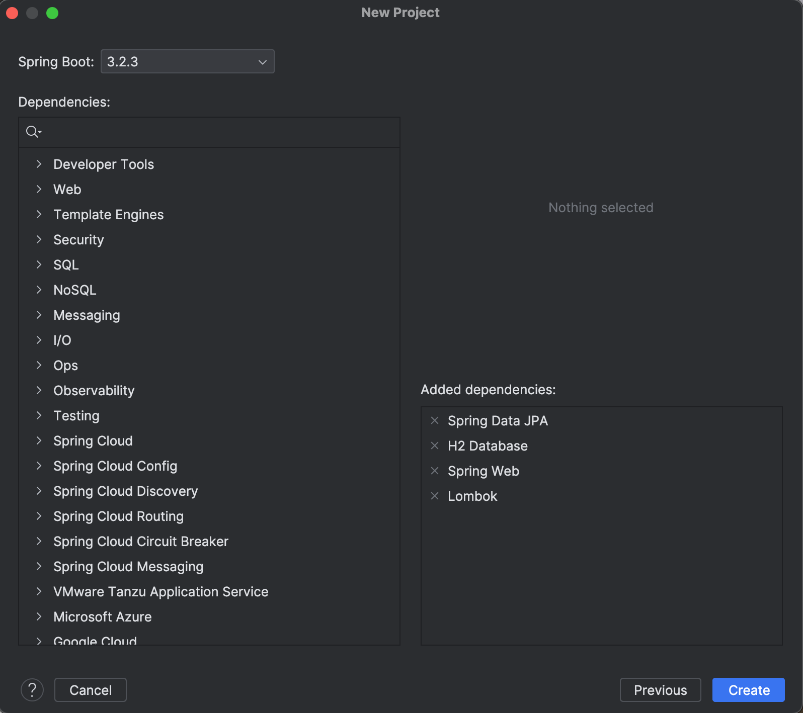

<h1> Compte rendu </h1>
<h3> Afirrah Aya G1 </h3>
<h4> 1. Créer un projet Spring Initializer avec les dépendances JPA, H2, Spring Web et Lombock :</h4>

<h4> 2. Créer l'entité JPA Product ayant les attributs :</h4>
<h6>- id de type Long</h6>
<h6>- name de type String</h6>
<h6>- price de type double</h6>
<h6>- quantity de type int</h6>

<h4> 3. Configurer l'unité de persistance dans le ficher application.properties :</h4>

<h4> 4. Créer l'interface JPA Repository basée sur Spring data :</h4>

<h4> 5. Tester quelques opérations de gestion de patients :</h4>

<h4> 6. Tester quelques opérations de gestion de patients :</h4>

